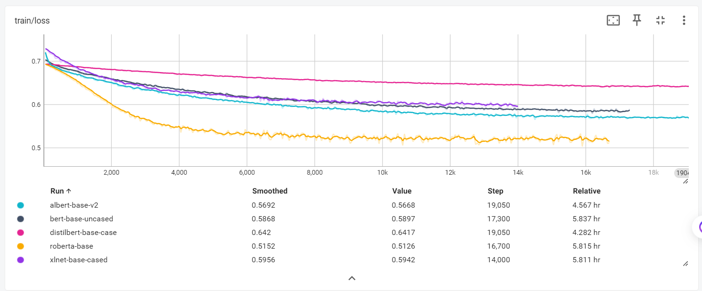
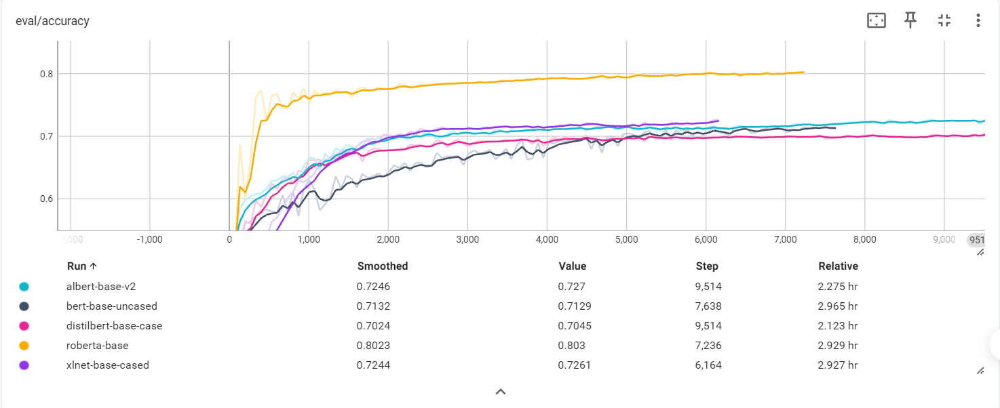

# Model Training 项目
这是一个基础的模型训练实战项目，运用了HuggingFace的Trainer或者传统的模型训练API训练模型

下面介绍一下训练的数据集
* **AG's News 数据集**；该数据集是一个长度适中的四分类数据集，分类标签包括*World*,*Sports*,*Business*和*Sci/Tech*四个种类。该数据集被广泛运用在文本分类领域。
* **Rotten Tomatoes 数据集**；该数据集是一个短文本情感分类数据集，分类标签包括*Positive*和*Negative*两个种类。该数据集被广泛运用在情感分类领域。

以RT数据集为例介绍一下

## Rotten Tomatoes数据集上的训练

主要在以下几个模型上展开：
* BERT
* RoBerta
* xlnet
* albert
* distilbert

其在训练集上的损失函数变化如下：

在测试集上的准确率变化如下：

可以看到准确率普遍不高

分析结果如下：
* 数据量，RT数据集的训练集只有8k个文本，每个文本的长度不足256
* <code>max_length</code>设置为128，但RT数据集很多数据远不到这个长度，需要很多个<code>[PAD]</code>，导致分类不准。